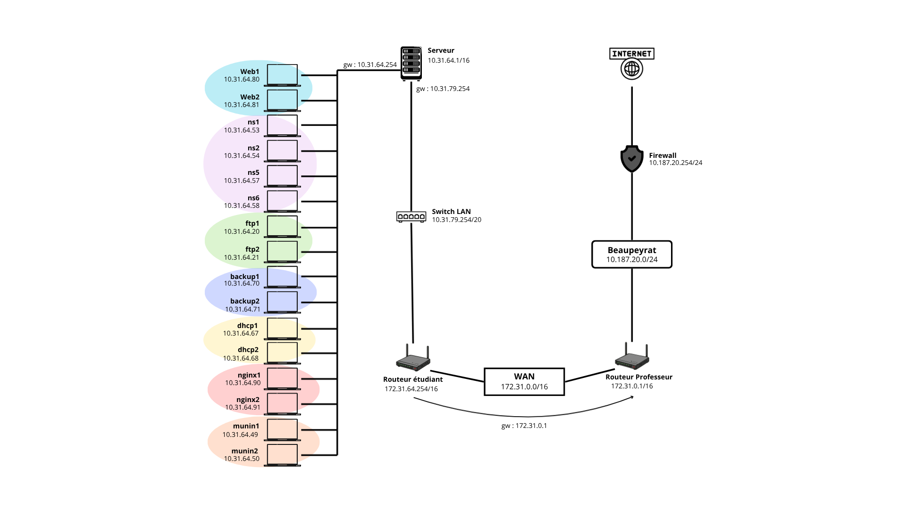

# BTS SIO 1 - SISR 2026 — Groupe 64

> Documentations techniques du groupe 64

## Documentations M2L

- Mission 0 : [Étude du contexte](missions/mission0-contexte.md)
- Mission 1 : [Installation des systèmes](missions/mission1-installation-sys.md)
- Mission 1.2 : [Installation d'un container LXC](missions/mission1.2-container-lxc.md)
- Mission 2 : [Installation LAMP](missions/mission2-lamp.md)
- Mission 3 : [Mise en place d'un serveur DNS](missions/mission3-dns.md)
- Mission 4 : [Script de sauvegarde](missions/mission4-sauvegarde.md)
- Mission 5 : [Serveurs FTP](missions/mission5-ftp.md)
- Mission 6 : [Serveurs web virtuels](missions/mission6-vhosts.md)
- Mission 7 : [SSL/TLS](missions/mission7-ssl-tls.md)
- Mission 8 : [Netfilter et iptables](missions/mission8-iptables.md)
- Mission 9 : [Service DHCP](missions/mission9-dhcp.md)
- Intermission : [Migration Apache](missions/intermission-nginx.md)
- Mission 10 : [Supervision avec Munin](missions/mission10-munin.md)

## Documentations travaux annexes

- Travaux 1 : [Mise en place et configuration du service SSH](travaux/travaux1-ssh.md)
- Travaux 2 : [Configuration de Vlan sur switch Cisco](travaux/travaux2-vlan-cisco.md)

## Table d'adressage

| Machines Abdelillah | Adresses | Machines Shirine | Adresses |
|---|---:|---|---:|
| web1 | 10.31.64.80 | web2 | 10.31.64.81 |
| ns1 | 10.31.64.53 | ns5 | 10.31.64.57 |
| ns2 | 10.31.64.54 | ns6 | 10.31.64.58 |
| ftp1 | 10.31.64.20 | ftp2 | 10.31.64.21 |
| backup1 | 10.31.64.70 | backup2 | 10.31.64.71 |
| dhcp1 | 10.31.64.67 | dhcp2 | 10.31.64.68 |
| nginx1 | 10.31.64.90 | nginx2 | 10.31.64.91 |
| munin1 | 10.31.64.49 | munin2 | 10.31.64.50 |

## Schéma réseau

